# DolphinDB VSCode Extension for SQLTools 

This package is part of [vscode-sqltools](https://vscode-sqltools.mteixeira.dev/?umd_source=repository&utm_medium=readme&utm_campaign=mysql) extension.

> **Note**: The original project development environment is based on Node.js v20, which does not support the `--experimental-transform-types` compilation option. As a result, this project cannot be run directly with Node.js v20. To resolve this, the Node.js version must be upgraded to v22 or above. The local testing environment is currently using Node.js v22.12.0.


## Use

### Click the SQLTools Database Icon
Click the SQLTools database icon to navigate to the connection configuration interface.

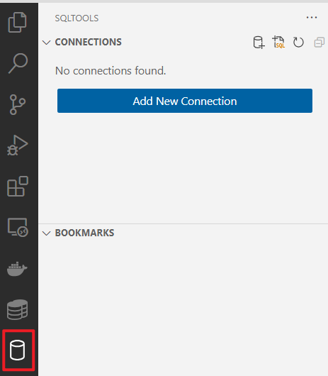

### Select DolphinDB in the Driver Field
In the "Select your database driver" field, select DolphinDB.

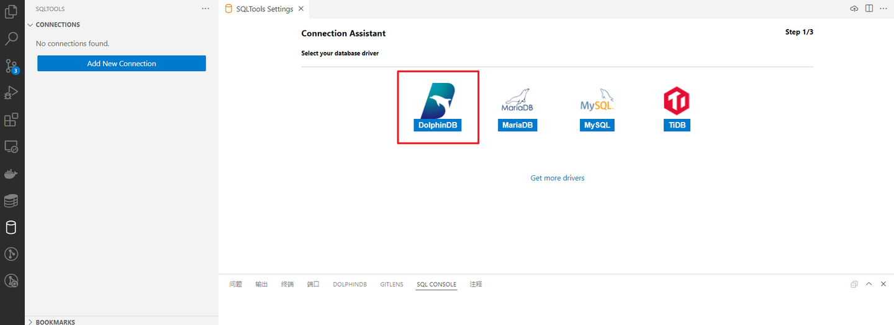


### Configure Connection Information
Fill in the connection details. Fields marked with an asterisk (*) are required. 

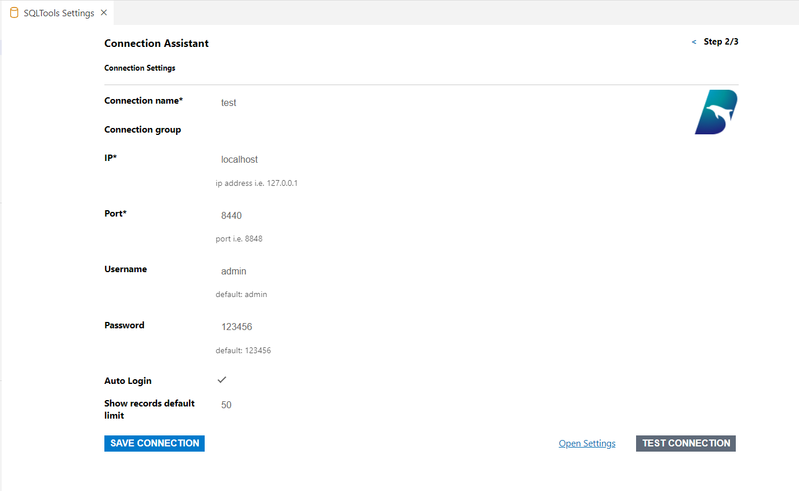

The configurations are as follows:

* **Connection Name***:
A custom string to identify different connections. It is recommended to use the node alias, such as local8848 or dnode1.
* **IP***: The IP address of the node.
* **Port***: The port number of the node.
* **Username**: The username for authentication. The default administrator username for DolphinDB is admin.
* **Password**: The password for authentication. The default password for the DolphinDB administrator is 123456. You can change the password using the changePwd function.
* **Auto Login**: An option to enable automatic login. The default value is false. If a username and password are provided, you can choose whether to enable automatic login.
* **Show Records Default Limit**: The default number of records displayed per page.

### Test and Save the Connection

After configuring the connection, click the `TEST CONNECTION` button to verify if the connection is successful.

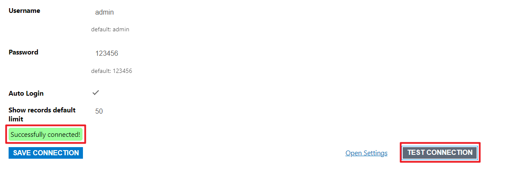

If the test is successful, click `SAVE CONNECTION` to save the connection information.


### Connect and Start Scripting

After saving, the system will display basic connection information. Confirm that the details are correct.

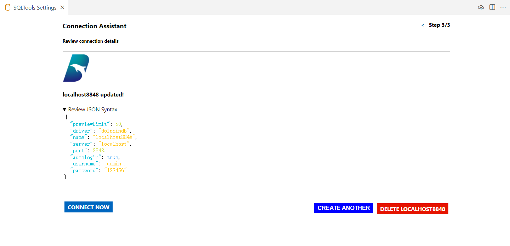

Click `CONNECT NOW` to establish the connection and create a new SQL file for writing scripts.

## UI Interface Description

### SQL Tools Section

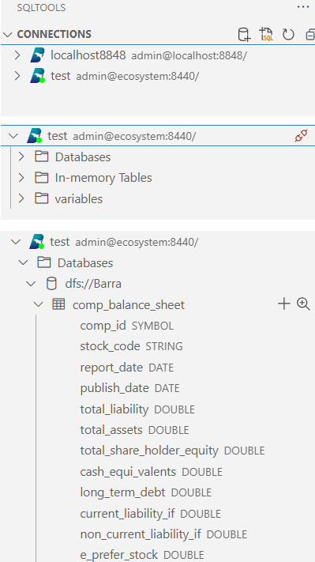

The SQL Tools section displays different connection information. Each connection includes three subdirectories:

* **Databases**: Contains distributed database and table information. Information includes: database name, table name, column name, and column type.

* **In-memory Tables**: Contains in-memory table information. Information includes: table name, column name, and column type.

* **Variables**: Contains information about other variables. Information includes: variable name and variable type (e.g., matrix, scalar, set, etc.).

### Operations

For table-type objects, click the `magnifying glass` button on the right to view table data.

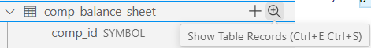


Click the `+` button to generate an insert statement.

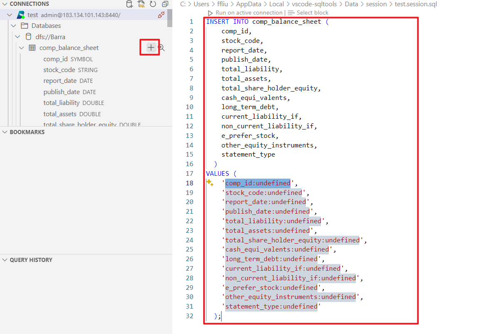


In the script execution section, users can write scripts and then click `Run on active connection` to execute the script.

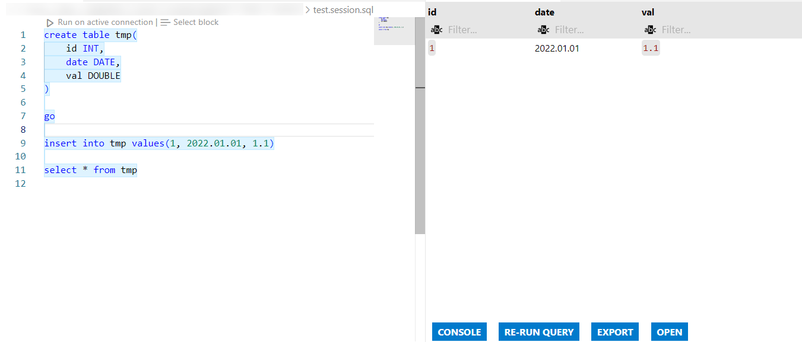

The results section on the right will display the results returned by the script calculation.

The results section is used to display the following:

* Query script execution results.
* Table records queried using the Show Table Records command.

    > **Note**: When executing a script with multiple statements in DolphinDB, only the result of the last statement is returned.


* Function Buttons:

    * **CONSOLE**: SQL terminal, outputs execution information. Typically, execution information includes details such as the dimensions, type, and data format of the returned object.
      
        

    * **RE-RUN QUERY**: Re-executes the statement.
    * **EXPORT**: Exports execution results in JSON or CSV format.

        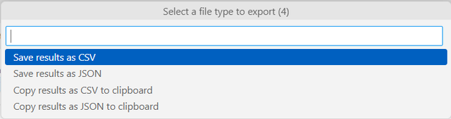

    * **OPEN**: Views execution results as a CSV or JSON file.

        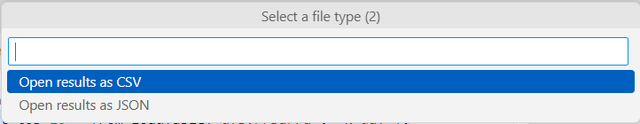

### Query History Section

The QUERY HISTORY on the left saves the query history for a specific connection.

## Development Instructions

```shell
# Install pnpm package manager
npm install -g pnpm

# Install project dependencies
pnpm install

# Start development
pnpm run dev

# Format code and automatically fix code errors
pnpm run fix

# Scan entries
pnpm run scan
# Manually complete untranslated entries
# Run scan again to update the dictionary file dict.json
pnpm run scan

# Build
# pnpm run build
```
